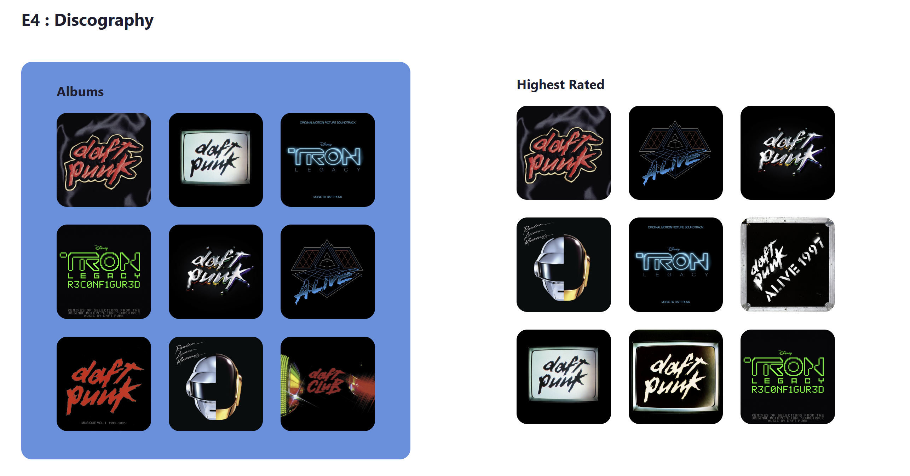

# 🗃️ Exercise 4: Working with Arrays (`map`, `filter`, `key`)

This exercise reviews crucial JavaScript array methods and their direct application in React for rendering lists of data. You'll focus on **`map`** for generating components and **`filter`/`sort`** for manipulating the data before rendering.

---

## 📚 Concepts: Array Methods in React

### 1\. JavaScript Array Methods Recap

In React, you often receive an array of data (like a list of albums) and need to transform or modify it before it can be displayed. The following methods execute a function (**callback**) on every element and return a new array (or a new single value, like in `reduce`).

When using array iteration methods (`map`, `filter`, `sort`, etc.), the function you provide (the callback) is executed once for each item in the array. This callback function automatically receives the following arguments:

1. item (or element): The current element being processed in the array.
2. index: The index of the current element.
3. array: The array the method was called upon.

Crucially, if you are iterating over an array of JavaScript objects (like the albums array), the item argument gives you full access to that object's keys.

This allows you to perform conditional checks (item.strAlbumThumb), sorting comparisons (a.intScore - b.intScore), and data extraction.

Here is the updated table with the **`toSorted()`** method included:

| Method           | Purpose                                                                                                                                   | Returns                              |
| :--------------- | :---------------------------------------------------------------------------------------------------------------------------------------- | :----------------------------------- |
| **`map()`**      | Executes a callback for every element and returns a **new array** containing the results of the callback.                                 | A new Array                          |
| **`filter()`**   | Executes a callback (which must return a boolean) and returns a **new array** containing only the elements that passed the test (`true`). | A new Array                          |
| **`sort()`**     | Sorts the elements of an array in place based on the return value of a comparator function.                                               | The sorted Array (modifies original) |
| **`toSorted()`** | Returns a **new, sorted array** based on the return value of a comparator function, leaving the original array unchanged.                 | A new Array                          |
| **`slice()`**    | Returns a shallow copy of a portion of an array into a **new array**.                                                                     | A new Array                          |

### 2\. Rendering Lists with `map()` and the `key` Prop

The most common way to display an array of data in React is by calling the `.map()` method directly within your component's JSX:

```javascript
const ListComponent = ({ items }) => {
  return (
    <ul>
      {items.map((item, index) => (
        // The component/element being returned by map
        <li key={item + index}>{item}</li>
      ))}
    </ul>
  );
};
```

Storing the result from map in a variable is an alternative when you need to perform conditional checks or complex logic before returning the final JSX.

```javascript
const ListComponent = ({ items }) => {
  // 1. Map the array to an array of JSX elements/components
  const listItemsJSX = items.map((item, index) => (
    <li key={item.id || index}>{item.name}</li>
  ));

  // 2. Display the variable in the return statement
  return <ul>{listItemsJSX}</ul>;
};
```

#### **The Importance of the `key` Prop**

When rendering a list of elements, **React requires every component or element within the `.map()` function to have a unique `key` prop.**

- **What it is:** The `key` is an internal identifier that React uses to track which items have been changed, added, or removed.
- **Why it matters:** Without a stable, unique key (like a database ID), React cannot efficiently update the DOM, leading to performance issues and potentially incorrect component state if the list order changes.
- **Best Practice:** Always use a stable, unique ID from the data (e.g., `album.idAlbum`). Only use the index (`index`) as a fallback if the list is static and never changes order.

### 3\. Array Method Chaining

Since array methods like `filter()`, `slice()`, and `map()` all return new arrays, you can easily **chain them together** for sequential operations. This is extremely common in React for preparing data for display.

```javascript
// Example: Filter out invalid entries, then sort them, then show only the top 5 by creating a component
const processedData = rawData
  .filter((item) => item.isValid)
  .toSorted((a, b) => b.score - a.score)
  .slice(0, 5)
  .map((item) => <ItemComponent key={item.id} data={item} />);
```

---

## 🛠️ Challenges

This exercise requires you to update both the parent components (`Home.jsx`), (`Exercise4.jsx`) and the child component (`AlbumTiles.jsx`).

### Part 1: Prop Drilling and Data Access (Parent Component)

The `albums` array needs to be passed into the `Exercise4` component to be processed.

1.  **Pass the Prop:** Locate the parent component of `Exercise4` (`Home.jsx`). Find where the `albums` array is defined (likely as a state variable).
2.  **Define the Prop:** Ensure this component is passing the `albums` array to the `<Exercise4 />` component as a prop named **`albums`**.

    - _Hint: The required change is:_ `<Exercise4 albums={albums} />`

### Part 2: Generating Component Lists (`AlbumTiles.jsx`)

Open the `AlbumTiles.jsx` file. This component receives an array of album objects (`albumsArr`) and maps over them to create a list of album links.

1.  **Set Image Source:** Locate the `` tag inside `cardListJSX`. Use JSX to dynamically set the `src` attribute of the image to the album's thumbnail using the object key **`album.strAlbumThumb`**.
2.  **Define a Unique Key:** Locate the `<Link>` element. Ensure the `key` attribute is set to the unique album ID: **`album.idAlbum`**. (The existing key logic using `title + index` is a common but sub-optimal fallback that you should replace.)

### Part 3: Filtering Data (`Exercise4.jsx`)

Open the `Exercise4.jsx` file. The initial `albums` array contains some album entries that are missing a thumbnail image, which will cause broken image icons.

1.  **Complete the Filter:** create a `filteredAlbums` variable declaration. Complete a filter to only keep albums that have a value (not `null`) for the thumbnail key: **`album.strAlbumThumb`**.

### Part 3: Sorting and Slicing Data (`Exercise4.jsx`)

You need to use array methods to prepare two different datasets for the two components being rendered.

1.  **All Albums Component:** The first `<AlbumTiles>` component (titled "Albums") currently receives all filtered albums. Update the prop `albumsArr` to use the `filteredAlbums` and also use a **`.slice()`** method to pass only the **first 9** albums from the array.
2.  **Highest Rated Component:** The second component (titled "Highest Rated") should display the 9 albums with the highest rating.
    - Create a `highestRating` variable. Use the **`.toSorted()` or `sort()`** method to sort the `filteredAlbums` based on the album's score key: **`intScore`**. If you use `sort` make sure to create a copy as it will modify your array in place meaning both components will display the same data.
    - Ensure the sort returns the **highest scores first** (descending order).
    - Pass the sorted array to the `albumsArr` prop, using **`.slice()`** to limit the result to the **first 9** albums.

### Completion Goal:

When finished, you should see two sections:

1.  **Albums:** Displays the first 9 available albums (only those with an image).
2.  **Highest Rated:** Displays the 9 highest-rated albums (sorted by `intScore`).

See below for an example of the complete component.



---

## 📝 Additional/Optional Resources

- [React Docs : Rendering Lists](https://react.dev/learn/rendering-lists)
- [MDN .filter()](https://developer.mozilla.org/en-US/docs/Web/JavaScript/Reference/Global_Objects/Array/filter)
- [MDN .map()](https://developer.mozilla.org/en-US/docs/Web/JavaScript/Reference/Global_Objects/Array/map)
